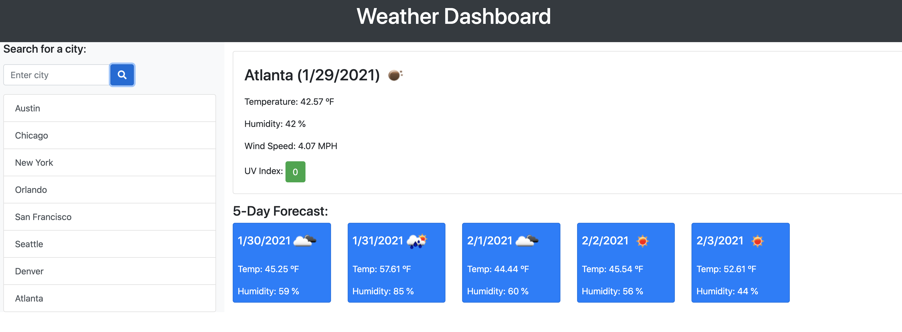

# Weather Dashboard

Plan your day by checking the current weather conditions and the 5 Day Forecast for the desired city.

## How-to:

To begin, type a city name in to the 'Enter city' search bar. Below, you will see the most recent searched city appended to the previously searched city, if you have searched for more than one city. To the right of the search bar, you will see the city name, current day, an icon of the current weather condition, along with Temp, Humidity, Wind Speed, and UV Index. Below the current weather conditions, you will also see the next 5 day forecast.

### Resources

[Reddit](https://www.reddit.com/r/FreeCodeCamp/comments/4con5s/how_do_i_use_the_icon_given_in_the_open_weather/)

### Screenshot

### Links

* [LinkedIn](https://www.linkedin.com/in/cdfox/)
* [GitHub-Repositories](https://github.com/CFox2019/Weather-Dashboard)
* [GitHub-live-link]()
